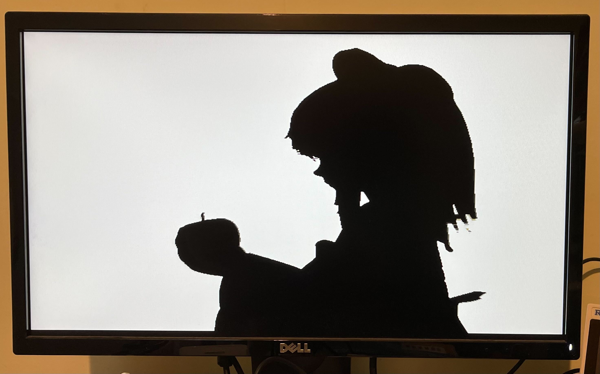

<!---

This file is used to generate your project datasheet. Please fill in the information below and delete any unused
sections.

You can also include images in this folder and reference them in the markdown. Each image must be less than
512 kb in size, and the combined size of all images must be less than 1 MB.
-->

## How it works

A 6bpp run length encoded image or video is read from a W25Q128JV or similar QSPI flash, and output to 640x480 VGA.

This is perfect for displaying the Bad Apple music video.

### Run Length Encoding

The encoding uses 16-bit words. Most words are a run length in the top 10 bits, and a colour in the bottom 6 bits.  A run must come to the end at the end of each row.

A run must be at least 2 pixels, and any group of 3 consecutive runs within a row must be at least 12 pixels, otherwise the data buffer will empty.

8-bit mono audio data can be interleaved into the video stream.  The PWM output value is updated by the value `0xC000 + sample`, these must be at the end of a row, but do not have to be present on every row.  With a 24MHz project clock the row clock is exactly 30kHz.

To compress the audio slightly, sample deltas can also be used, packing 2, 3 or 4 samples into one command.  These add a signed offset to the current sample value at the end of the next 2, 3 or 4 rows:

* `0xD000 + (offset1 << 6) + offset2` with 2 6-bit signed offsets
* `0xE000 + (offset1 << 8) + (offset2 << 4) + offset3` with 3 4-bit signed offsets
* `0xF000 + (offset1 << 9) + (offset2 << 6) + (offset3 << 3) + offset4` with 4 3-bit signed offsets

This means that quieter audio takes less space!

Note that row and frame repeat, which were supported on the TT07 and TT IHP 0p2 versions are not supported here because audio data is interleaved into the video data.

The data is read starting at address 0.  The special word `0xBFC0` causes the player to stop and restart from address 0 at the beginning of the next frame, restarting the video.  This could also be used to display a still image.

## How to test

Create a RLE binary file (docs/scripts to do this TBD) and load onto the flash.  The pinout matches the [QSPI Pmod](https://github.com/mole99/qspi-pmod).  This should be plugged into the [audio Pmod](https://github.com/MichaelBell/tt-audio-pmod), and then the audio Pmod plugged into the bidir pins.  Note the flash must support the h6B Fast Read Quad Output command, with 8 dummy cycles between address and data.

Connect the [Tiny VGA PMOD](https://github.com/mole99/tiny-vga) to the output pins.

Inputs 2-0 set the read latency for the SPI in half clock cycles, it's likely that will need to be set to 2 (set input 1 high and inputs 0 and 2 low).  This latency depends on the total round trip time through the mux and out to the flash and back.  Valid values are 1 to 4.

Run with a 24MHz clock.

## External hardware

* [QSPI PMOD](https://github.com/mole99/qspi-pmod) plugged into [Audio PMOD](https://github.com/MichaelBell/tt-audio-pmod)
* [Tiny VGA PMOD](https://github.com/mole99/tiny-vga)
